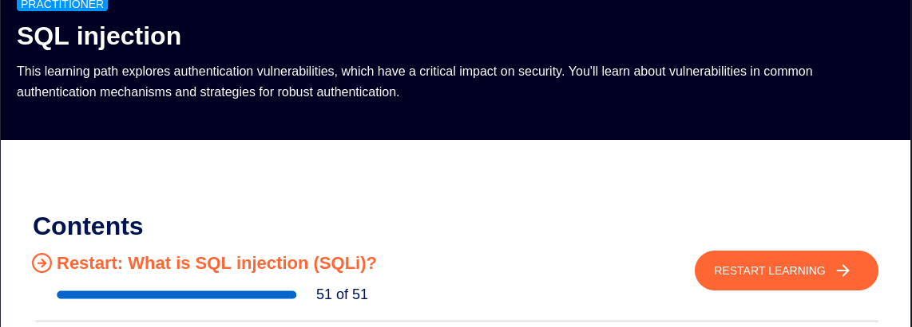

# SQL-Injection With Labs on PortSwigger
**Carry-out**:
- OS: Kali linux 2024.2
- Tools: Burp Suite, VSCode
- Extensions: Cookie Editor, Foxy Proxy, Hackvertor (for XML)
- Language: Python
- Markdown

